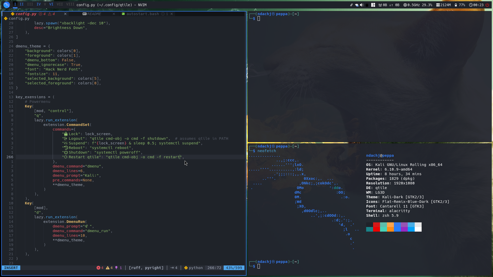
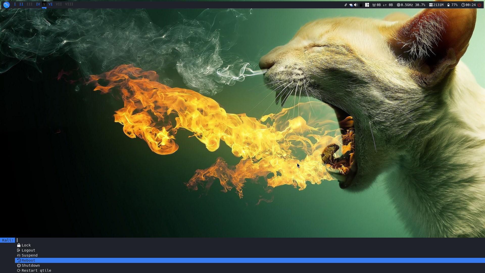

#  Qtile config




- About [Qtile](https://github.com/qtile/qtile)

- [Installation](https://docs.qtile.org/en/stable/manual/install/index.html)

## 📦 Dependencies

- Python: `python3-dbus-next, python3-psutil`

- Nerd font (Font that supports glyphs/icons):
  [get Nerd font](https://github.com/getnf/getnf)

- Programs: `alacritty, thunar, brave-browser, feh, alsa-utils, volumeicon-alsa,
htop, light-locker, xbacklight, dmenu, picom, numlockx, xfce4-appfinder,
xfce4-screenshooter, xfce4-clipman`

  ```Python
  mod = "mod4"  # Super/Window key
  # mod1 = "mod1"  # Alt key
  browser = "brave-browser"
  files = "thunar"
  terminal = "alacritty"
  launcher = "xfce4-appfinder"
  screnshot = "xfce4-screenshooter -m"
  lock_screen = "light-locker-command --lock"
  font = "Hack Nerd Font"
  ```

Default configuration file: `XXX/libqtile/resources/default_config.py` or `/usr/lib/python3.XX/site-packages/libqtile/resources/default_config.py`

Log file: `~/.local/share/qtile/qtile.log`

Check configuration file for errors: `qtile check`

## 👑 See Also

[qtile-examples](https://github.com/qtile/qtile-examples)

[Kali-i3](https://gitlab.com/Arszilla/kali-i3)
